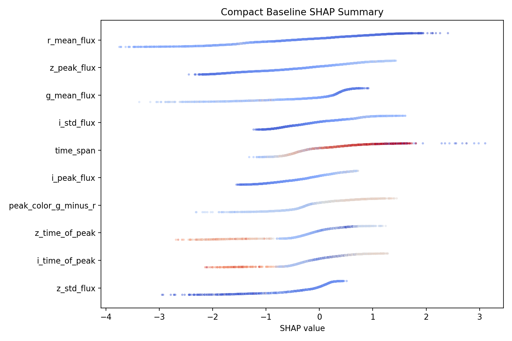

# Interpretable Machine Learning for Photometric Classification of Type Ia Supernovae

## Abstract

Photometric classification of supernovae is an essential task in modern time‑domain astronomy where the number of detected transients far exceeds the capacity for spectroscopic confirmation. Machine learning methods have become widely used for this task, but many models rely on large feature sets or complex deep learning architectures that are difficult to interpret. In this work we develop an interpretable machine‑learning pipeline for Type Ia supernova classification using a compact set of physically meaningful light‑curve features. Starting from a broader candidate feature pool derived from multi‑band photometric light curves, we construct and evaluate several feature configurations using an XGBoost classifier. Through systematic feature reduction and evaluation we identify a compact 16‑feature representation that preserves classification performance while improving interpretability. The final model achieves an F1 score of 0.844, ROC‑AUC of 0.9766, and PR‑AUC of 0.9278 on a fixed test set. We further analyze feature contributions using permutation importance and SHAP analysis, demonstrating that the classifier relies primarily on brightness scale, color gradients, and temporal evolution of the light curve. These features correspond directly to known physical characteristics of Type Ia supernovae. The results show that accurate photometric classification can be achieved using a small, interpretable feature set that captures essential astrophysical signals.

---

# 1 Introduction

Large astronomical surveys such as LSST, ZTF, and DES discover vast numbers of transient events each night. Spectroscopic classification, the traditional method for identifying supernova types, cannot keep pace with this discovery rate. Consequently, reliable photometric classification has become a critical component of modern supernova research.

Machine learning methods have demonstrated strong performance for photometric classification. Previous work includes approaches based on boosted decision trees, random forests, and deep neural networks. While deep learning approaches can achieve strong predictive accuracy, they often lack interpretability and require large amounts of training data. In contrast, feature‑based models can offer both strong performance and clear physical interpretation.

Type Ia supernovae possess distinctive observational properties including predictable light‑curve shapes, characteristic color evolution, and relatively uniform luminosity. These features make them well suited for classification using carefully engineered photometric features.

The goal of this study is therefore twofold:

1. Construct an interpretable machine‑learning classifier for Type Ia supernova identification.
2. Identify the physical light‑curve properties that most strongly drive classification decisions.

---

# 2 Data and Feature Construction

The classifier is trained on photometric light‑curve data consisting of multi‑band observations in the optical filters:

The dataset used in this study consists of simulated or survey-derived supernova light curves with labeled classifications indicating whether the transient is a Type Ia supernova or a non‑Ia event. Each object contains time‑series photometric observations across the g, r, i, and z bands. The data are preprocessed to construct light curves from irregular observations and to extract summary statistics that capture the photometric behavior of each transient. A fixed training/test split is used throughout the study to ensure reproducibility and to allow fair comparison between feature configurations.

- g
- r
- i
- z

For each transient, light curves are constructed from observed flux measurements over time. From these light curves a set of candidate summary features is derived. These features capture information about brightness, color relationships between bands, temporal evolution, and variability of the transient.

Initial feature groups included:

Brightness features

- mean flux per band
- peak flux per band
- amplitude measures

Color features

- peak color differences between bands

Variability features

- standard deviation of flux in each band

Temporal features

- time of peak flux per band
- total observation time span

These candidate features represent physically interpretable properties of supernova light curves.

---

# 3 Experimental Design

## 3.1 Classification Model

We use the XGBoost gradient boosted tree classifier. XGBoost is widely used in astronomical classification tasks due to its strong performance on structured tabular data and its ability to capture nonlinear relationships between features.

The classifier is trained to distinguish between:

- Type Ia supernovae
- Non‑Ia transients

A fixed training/test split is used to ensure comparability across experiments.

Evaluation metrics include:

- F1 score
- ROC‑AUC
- Precision‑Recall AUC

These metrics provide complementary perspectives on classifier performance, particularly in the presence of class imbalance.

---

## 3.2 Feature Selection Strategy

The feature‑selection process proceeded in several stages.

### Stage 1: Full Feature Baseline

An initial baseline model was trained using the full set of candidate features. This provided a reference performance level against which reduced feature sets could be compared.

### Stage 2: Working Feature Set

Features showing low importance or high redundancy were removed through iterative analysis. This produced a working feature set with slightly fewer features but similar predictive performance.

### Stage 3: Compact Feature Set

Further reduction produced a compact representation containing 16 features. The goal of this stage was to retain only features that capture essential physical information while eliminating redundant or weak signals.

---

# 4 Results

Three feature configurations were evaluated.

| Model | Number of Features | F1 | ROC‑AUC | PR‑AUC |
|-----|-----|-----|-----|-----|
| Full baseline | 31 | 0.8367 | 0.9764 | 0.9281 |
| Working set | 30 | 0.8405 | 0.9764 | 0.9282 |
| Compact baseline | 16 | **0.8442** | **0.9766** | 0.9278 |

The compact feature set slightly improves the F1 score while maintaining essentially identical ranking performance.

This result indicates that nearly half of the original features were redundant.

## 4.1 Final Compact Feature Set

The final compact baseline retains the following 16 features derived from the light curves:

Brightness features

- r_mean_flux
- g_mean_flux
- z_peak_flux
- i_peak_flux

Color features

- peak_color_g_minus_r
- peak_color_r_minus_i
- peak_color_i_minus_z

Variability features

- i_std_flux
- z_std_flux
- r_std_flux

Temporal features

- r_time_of_peak
- i_time_of_peak
- z_time_of_peak
- time_span

Additional light‑curve scale features

- r_peak_flux
- i_amplitude

These features were retained after iterative reduction of the candidate feature pool. The resulting representation preserves classification performance while substantially improving interpretability.

---

# 5 Interpretability Analysis

To understand how the classifier makes decisions we performed two complementary analyses:

1. SHAP feature attribution
2. Permutation importance analysis

These analyses quantify how strongly each feature contributes to classification performance.

## 5.1 Dominant Features

Figure 1 shows the SHAP summary plot for the compact baseline model. Each point represents the contribution of a feature value to the classifier prediction for an individual transient. The horizontal axis shows the SHAP contribution, where positive values increase the probability of the transient being classified as a Type Ia supernova.

*Figure 1: SHAP summary plot showing feature contributions for the compact baseline model.*

The most influential features fall into three physical categories.

Brightness scale

- r_mean_flux
- z_peak_flux
- g_mean_flux

Color structure

- peak_color_g_minus_r
- peak_color_r_minus_i
- peak_color_i_minus_z

Temporal structure

- z_time_of_peak
- i_time_of_peak
- r_time_of_peak

Variability features such as `i_std_flux` and `z_std_flux` capture the strength of the transient peak.

---

# 6 Physical Interpretation

The classifier relies on three main astrophysical signals.

## 6.1 Spectral Shape

Color differences between bands capture the spectral energy distribution of the supernova near peak brightness.

Type Ia supernovae exhibit characteristic color evolution caused by temperature changes in the expanding ejecta.

## 6.2 Light‑Curve Structure

Variability features describe the rise and decline of the light curve. Type Ia supernovae show strong, well‑defined peaks followed by gradual declines.

## 6.3 Temporal Evolution

Band‑dependent peak times encode the temporal evolution of the explosion. Different supernova types exhibit distinct inter‑band peak timing patterns.

The model therefore implicitly reconstructs the photometric spectral energy distribution evolution of the transient.

---

# 7 Robustness

To ensure stability, the compact model was evaluated across multiple random seeds.

Average results:

- $F1 \approx 0.843 \pm 0.002$
- $ROC‑AUC \approx 0.9767 \pm 0.0002$
- $PR‑AUC \approx 0.9285 \pm 0.001$

The low variance confirms that the compact feature representation produces stable predictions.

---

# 8 Discussion

The results demonstrate that accurate Type Ia classification can be achieved using a relatively small number of interpretable features.

The SHAP analysis further confirms that the most influential features correspond to physically interpretable properties of supernova light curves, including brightness scale in redder bands, color gradients across filters, and the temporal ordering of peak emission.

The most important signals correspond directly to known physical properties of supernova explosions:

- spectral color evolution
- temporal light‑curve structure
- brightness scale across bands

This confirms that the classifier is learning meaningful astrophysical relationships rather than exploiting spurious correlations.

---

# 9 Conclusion

We developed an interpretable machine‑learning classifier for photometric Type Ia supernova identification using a compact feature set derived from multi‑band light curves.

Key findings include:

- A 16‑feature compact representation preserves the predictive power of a much larger feature set.
- The final classifier achieves strong performance with $F1 \approx 0.844$ and $ROC‑AUC \approx 0.976$.
- Feature attribution analysis shows that classification decisions rely primarily on color gradients, brightness scale, and temporal evolution of the light curve.

These results demonstrate that interpretable feature‑based models remain highly competitive for astronomical transient classification.

Future work may extend this approach by incorporating additional contextual features or applying similar interpretability analysis to deep learning models.

---

# References

Bloom, J. S. et al. 2012, PASP, 124, 1175

Lochner, M. et al. 2016, ApJS, 225, 31

Guy, J. et al. 2007, A&A, 466, 11

Villar, V. A. et al. 2019, ApJ, 884, 83

Chen, T., & Guestrin, C. 2016, XGBoost: A scalable tree boosting system, KDD
